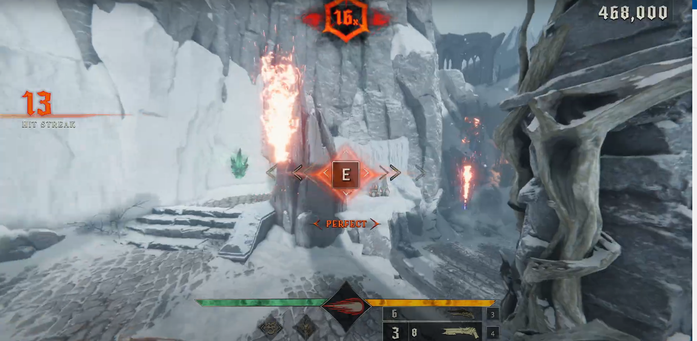

# 🎮 Metal: Hellsinger Assistance Tool 🕹️

This tool, created a few years ago, automates reloads, shoots, and executions to the beat in Metal: Hellsinger. It ensures perfect timing for dashes and other actions with specific button holds.

## Demo Video

[](https://youtu.be/KBX7BXV_Aow)

## Features 🌟

- **Automatic Reloads and Shoots**: The tool syncs with the game's beat to perform reloads and shoots.
- **Automatic Executions**: Executes enemies perfectly when required, just by holding a button.
- **Dash Support**: Enables precise dashing with another button hold, ensuring perfect timing.

## Prerequisites 📋

- **Python 3.x**: Make sure Python is installed on your system.
- **Required Libraries**: Install the necessary Python libraries using the following command:
  ```bash
  pip install -r requirements.txt
  ```
  - mss
  - numpy
  - keyboard
  - pywin32

- **ghub Version**: You need a specific version of ghub for this program to work correctly. You can download it from:
  [pythonp.xyz/ghub](http://pythonp.xyz/ghub)

## Installation 🛠️

1. **Clone the Repository**:
   ```bash
   git clone https://github.com/BoranCanOzel/Hellsinger-Assist.git
   ```
2. **Navigate to the Project Directory**:
   ```bash
   cd hellsinger-assist-tool
   ```
3. **Install Dependencies**:
   ```bash
   pip install -r requirements.txt
   ```

## Usage 🎯

1. **Run the Script**:
   ```bash
   python main.py
   ```
2. **Adjust Offsets**: You may need to update the pixel coordinates in `main.py` based on your screen setup:
   ```python
   pixel_x = -1076  # Adjust as needed
   pixel_y = 659    # Adjust as needed

   pixel_x2 = -972 # Adjust as needed
   pixel_y2 = 750 # Adjust as needed
   ```

## Notes 📝

- Ensure the correct version of ghub is running before starting the tool.
- Adjust the offsets for optimal performance based on your screen configuration.

## Troubleshooting 🛠️

- If the tool does not work as expected, check the following:
  - Ensure ghub is running.
  - Verify the pixel coordinates.
  - Check for any missing dependencies.

## Contributing 🤝

Contributions are welcome! Please fork the repository and create a pull request with your changes.


For any further assistance or queries, feel free to contact me.

Enjoy the game with perfect timing! 🎮✨
